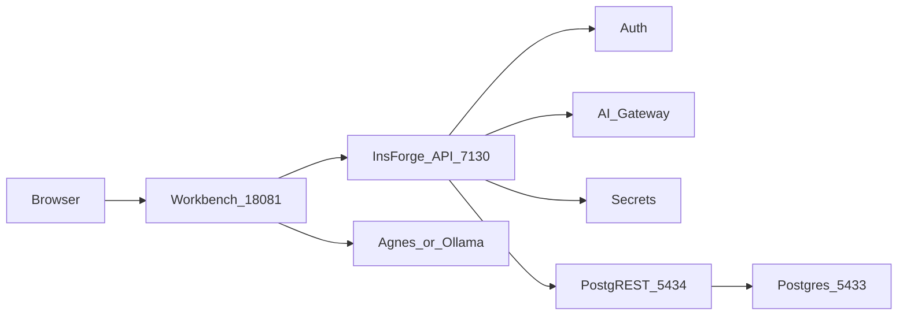

# CN-Social-Agent · 口播制片助手

给程序员 / 独立开发者的 **AI 口播制片**：从想法或链接，稳定产出「能发」的竖屏短视频（先 **分镜草稿 L0**，再升级 **成片 L1**）。

> 附带：Agent 热点选题 · 知识卡片 · 主题资产（人口图鉴在账号菜单「高级」）。


## 快速开始

```bash
.venv/bin/python -m pip install -r requirements.txt
.venv/bin/python scripts/ensure_workbench_tables.py
PYTHONPATH=src WORKBENCH_PORT=18081 WORKBENCH_STORE=insforge .venv/bin/python run_workbench.py
```

- 工作台（默认短视频口播）：http://127.0.0.1:18081/
- 强制口播模式：http://127.0.0.1:18081/?mode=video
- InsForge API：http://127.0.0.1:7130/
- InsForge 控制台：http://127.0.0.1:7131/



**黄金路径：** 选模板（产品更新 / 技术吐槽 / 教程）→ 写主题 → 生成分镜 → 确认 → **L0 草稿** → 升级 **L1 成片** → 下载。

新项目默认 **15s 停滑**（教程模板约 90s；深度分析可升到 180s）。

本机需有 `ffmpeg`；`edge-tts`、`pillow` 见 `requirements.txt`。

LLM 路由（`WORKBENCH_LLM=auto`）优先：

1. **Agnes**（`AGNES_API_KEY` 或 `config/default.yaml` 的 `llm.api_key`）
2. InsForge Gateway（OpenRouter Key）
3. Ollama（本机）
4. MiniMax
5. mock

也可在工作台**顶栏**切换提供商/模型（偏好同步账号）。强制 Agnes：`WORKBENCH_LLM=agnes`。

平台凭证（微信/头条）在顶栏 **平台** 配置。

### 成片 Storage（InsForge）

L0/L1 渲染成功后，会把 `final.mp4` 上传到私有桶（默认 `koubo-videos`），key 写入项目 wbmeta。本机文件优先下载；本地被清后从 Storage 回源。

```bash
# 默认开启；关闭上传：
VIDEO_STORAGE_UPLOAD=0
# 自定义桶名：
VIDEO_STORAGE_BUCKET=koubo-videos
```

### Content Pack（垂直扩展）

默认加载 `packs/tech-saas`（模板 15s + 技能启停）。

```bash
WORKBENCH_PACK=tech-saas          # 默认
WORKBENCH_PACK=none               # 关闭
WORKBENCH_PACK_FILE=/path/pack.yaml
# 或客户覆盖：data/customers/<id>/pack.yaml（配合 USAGE_CUSTOMER_ID）
```

查看：`GET /api/packs/active`（需登录）。


## 测试与 CI

```bash
PYTHONPATH=src .venv/bin/python -m pytest tests/workbench -q
```

GitHub Actions：`.github/workflows/workbench-ci.yml`（push / PR 跑 `tests/workbench`）。

本地冒烟（需工坊已启动）：

```bash
WORKBENCH_URL=http://127.0.0.1:18081 .venv/bin/python scripts/smoke_insforge_workbench.py
WORKBENCH_URL=http://127.0.0.1:18081 .venv/bin/python scripts/smoke_video_workshop.py
WORKBENCH_URL=http://127.0.0.1:18081 .venv/bin/python scripts/smoke_chat_to_video.py
WORKBENCH_URL=http://127.0.0.1:18081 .venv/bin/python scripts/smoke_fetch_url.py
WORKBENCH_URL=http://127.0.0.1:18081 .venv/bin/python scripts/smoke_artifact_plan.py
```

## 文档

- 定位与 90 天路线：`docs/superpowers/specs/2026-07-26-product-positioning-90d-roadmap.md`
- 短视频：`docs/superpowers/specs/2026-07-26-short-video-workshop-design.md`
- Agent：`docs/superpowers/specs/2026-07-26-insforge-agent-workbench-design.md`
- FDE 试点包（非本轮主线）：`docs/fde/`

### 用量周报（内部）

```bash
USAGE_CUSTOMER_ID=acme PYTHONPATH=src .venv/bin/python scripts/usage_weekly_report.py --days 7
# 或登录后 GET /api/usage/summary?days=7
```
